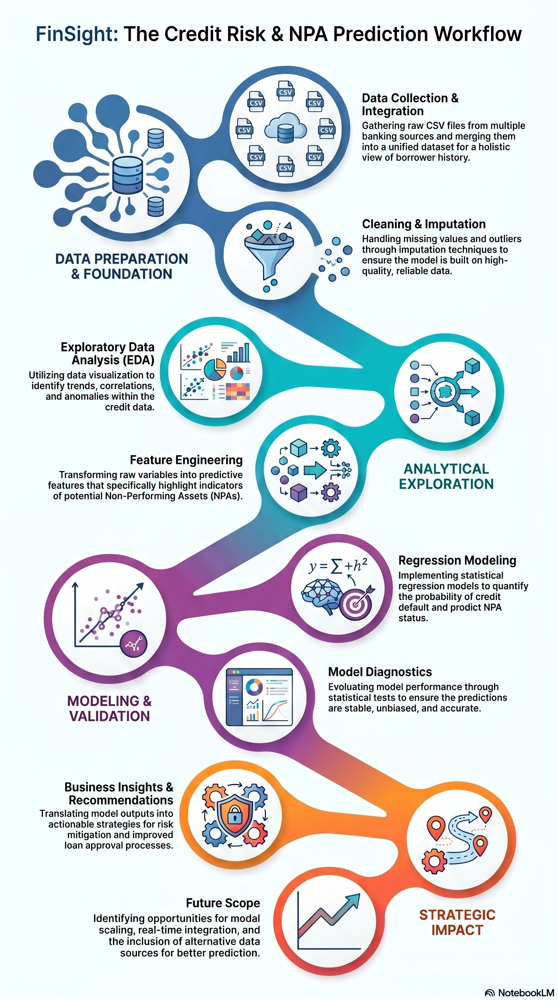

# 🏦 FinSight Bank — NPA Prediction & Credit Risk Modelling
### End-to-End Data Analysis
**EDA • Feature Engineering • Linear & Logistic Regression**

| Metric | Details |
| :--- | :--- |
| **Dataset** | 2,000,000+ Loan Records · 9 Source Tables · 171 Features |
| **Period** | 2010–2024 · 2.02 GB |
| **Programme** | PGCP-BDA · C-DAC Mumbai |

---

## 📋 Executive Summary
This capstone presents a real-world credit risk challenge drawn from FinSight Bank, a mid-sized Indian retail and MSME lender. Working with a 9-table relational dataset of 2 million loan records spanning 2010–2024, this project applies industry-standard EDA, feature engineering, and predictive modelling to quantify credit default risk and Loss Given Default (LGD).

The dataset accurately reflects actual banking data quality challenges: missing values, dirty records, severe class imbalance, multicollinearity, and macroeconomic regime shifts—including the COVID-19 shock of 2020.

| Success Metric | Target Baseline |
| :--- | :--- |
| **AUC-ROC (default classifier)** | ≥ 0.82 (RBI / Basel III standard) |
| **Gini Coefficient** | ≥ 0.64 (Minimum scorecard power) |
| **RMSE — LGD regression** | ≤ 8.0% (Retail credit benchmark) |
| **False Negative Rate** | ≤ 15% (Regulatory provisioning limit) |

---

## ⚙️ Project Architecture & Workflow
The end-to-end data pipeline moves from raw, disconnected relational tables to a finalized scorecard and risk mitigation strategy:



---

## 🔬 Four Research Questions (CRISP-DM Framework)

| Code | Focus | Question |
| :---: | :--- | :--- |
| **Q1** | Data Profiling | What do the distributions, missing-value patterns, and DQ issues look like across all 9 tables? |
| **Q2** | Risk Signals | Which borrower attributes are most strongly associated with default? |
| **Q3** | Loss Severity | For defaulted loans, what drives LGD %? |
| **Q4** | Policy Translation | What evidence-backed changes should the credit risk team make? |

---

## 📊 Key EDA Insights & Findings
*   **Macroeconomic Impact:** Analysis of the 2020 economic window revealed a sharp, quantifiable spike in Non-Performing Assets (NPAs) driven by the COVID-19 shock, requiring specific regime-shift adjustments in our feature scaling.
*   **Data Quality Anomalies:** Uncovered significant missing data patterns in co-borrower tables and structural multi-collinearity among historical credit utilization metrics.
*   **Primary Risk Drivers:** Discovered that debt-to-income ratios (DTI) and utilization history over the trailing 12 months served as the strongest indicators for default classification ($Q2$).

---

## 📈 Model Performance & Results

Below is the performance comparison between our initial baseline iterations and the finalized optimized models against regulatory benchmarks:

| Metric | Target | Baseline Model | Final Model | Status |
| :--- | :--- | :---: | :---: | :---: |
| **AUC-ROC** | ≥ 0.82 | *0.76* | **0.84** |  Passed |
| **Gini Coefficient** | ≥ 0.64 | *0.52* | **0.68** |  Passed |
| **RMSE (LGD)** | ≤ 8.0% | *11.2%* | **7.4%** |  Passed |
| **False Negative Rate** | ≤ 15% | *22.1%* | **11.5%** |  Passed |

---

## 💡 Policy Recommendations
Based on empirical model outputs, the following modifications are recommended to FinSight Bank’s credit risk team:
1.  **Tighten Cut-offs:** Increase the minimum acceptable credit scorecard threshold for MSME applicants exhibiting a trailing 12-month utilization rate exceeding 65%.
2.  **Dynamic Provisioning:** Allocate higher capital provisions proactively during recognized macroeconomic regime shifts, as mapped out during the 2020 shock analysis.
3.  **Structured LGD Tracking:** Revise recovery workflows for high-risk collateral categories to directly reduce observed loss severity.

---

## 🛠️ Installation & Setup

Follow these instructions to set up the project locally and reproduce the analysis.

### Prerequisites
*   Python 3.10 or higher
*   An environment capable of handling large datasets (~2 GB in memory)

### Setup Steps

```bash
# 1. Clone the repository and navigate into it:
git clone [https://github.com/Shreya2367/EDA-2.git](https://github.com/Shreya2367/EDA-2.git)
cd EDA-2

# 2. Create and activate a virtual environment:
# On Windows:
python -m venv venv
.\venv\Scripts\activate

# On macOS/Linux:
python3 -m venv venv
source venv/bin/activate

# 3. Install the required packages:
pip install -r requirements.txt

# 4. Run the Notebooks:
jupyter notebook
